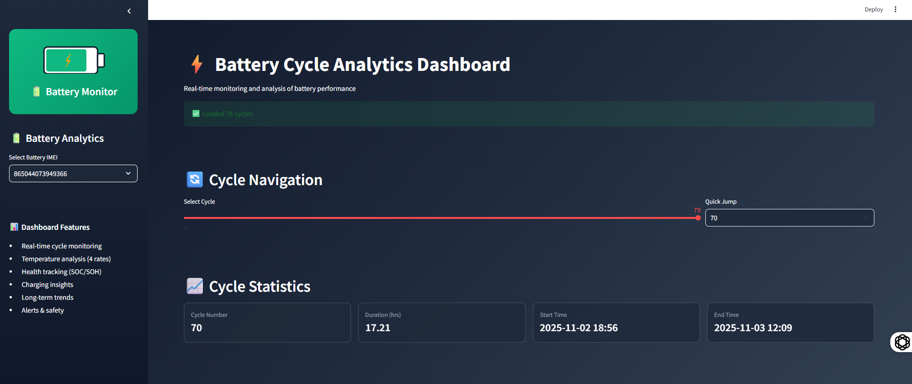
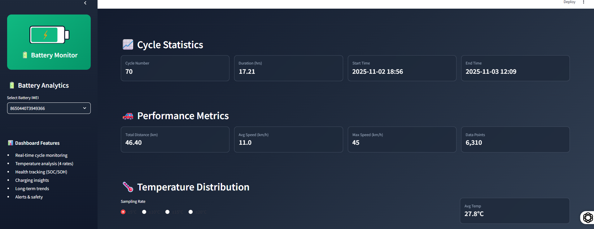
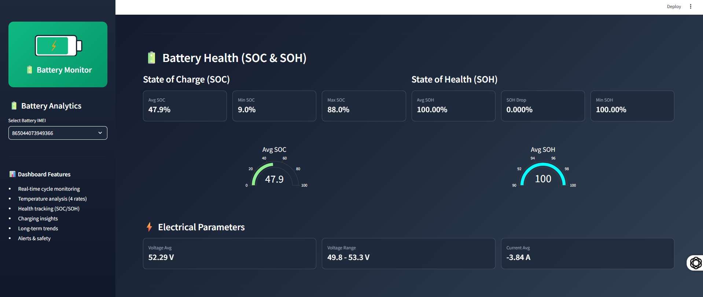
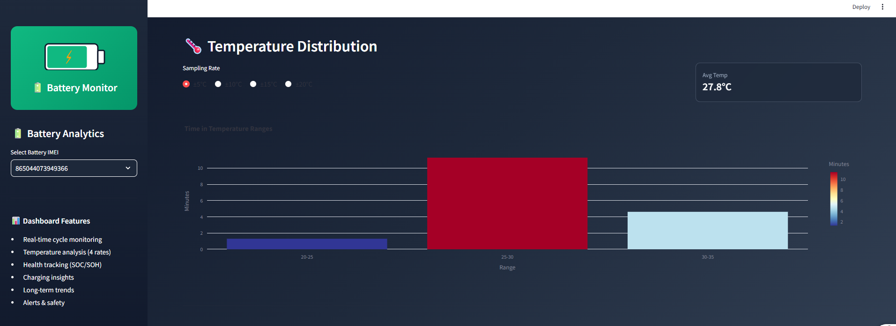

🔋 Battery Analytics Dashboard

Zenfinity Energy – Internship Assessment

An interactive, web-based Battery Analytics Dashboard built using Streamlit and Plotly, designed to visualize battery usage patterns, performance metrics, temperature behavior, safety alerts, and long-term operational trends using the Zenfinity Battery Snapshots API.

📌 Project Overview

This project was developed as part of the Zenfinity Energy Internship Assessment.
The goal is to analyze battery telemetry data to understand:

How a battery behaves during a single charge–discharge cycle

How performance and operating conditions vary across multiple cycles

How raw telemetry can be converted into meaningful engineering insights

The dashboard emphasizes clarity, usability, and real-world interpretability rather than raw data display.

🚀 Key Features
1️⃣ Cycle Navigation

Slider and dropdown to navigate across battery cycles

Instant jump to any cycle number

Responsive and smooth interaction even for large datasets

2️⃣ Cycle Statistics

For each selected cycle:

Cycle number

Start and end timestamps

Cycle duration (hours)

This provides context before analyzing performance or health metrics.

3️⃣ Performance Metrics

Total distance traveled

Average speed

Maximum speed

Data points count (indicates data completeness)

ℹ️ If distance is zero, the dashboard highlights possible GPS/data gaps instead of assuming an error.

4️⃣ Temperature Distribution Analysis

Visualizes time spent in different temperature ranges

Supports multiple sampling resolutions:

±5°C

±10°C

±15°C

±20°C

This helps analyze:

Thermal stress

Operating conditions

Temperature exposure during a cycle

5️⃣ Battery Usage (SOC – Cycle Level)

For the selected cycle:

Average SOC

Minimum SOC

Maximum SOC

Gauge visualization for intuitive understanding

SOC is used only for per-cycle analysis, not for long-term degradation modeling.

6️⃣ Electrical Parameters

Average voltage

Voltage minimum and maximum

Voltage range (stability indicator)

Average current

These metrics help assess:

Electrical stability

Cell balancing behavior

Abnormal voltage fluctuations

7️⃣ Alerts & Safety

Clearly displays:

Warnings

Protection events

Color-coded UI ensures:

Immediate visibility of safety-critical events

Easy distinction between normal and abnormal cycles

8️⃣ Charging Insights

Number of charging instances per cycle

Average SOC at charging start

Simple charging behavior classification:

Normal usage

Deep discharge behavior

📈 Long-Term Analysis & Insights

Beyond individual cycles, the dashboard performs cross-cycle analysis to identify broader operational patterns.

🔹 1. Voltage Stability Across Cycles

Voltage stability is calculated as:

Voltage Range = Voltage Max − Voltage Min

Why it matters:

Smaller voltage range → stable electrical behavior

Increasing variance may indicate:

Aging effects

Load inconsistency

Cell imbalance

Visualization:

Line chart across cycle numbers

Average reference line for comparison

Insight:

Consistent voltage ranges across cycles indicate healthy and stable battery operation.

🔹 2. Energy Efficiency Pattern (Proxy Analysis)

Since direct energy consumption is unavailable, an efficiency proxy is used:

SOC Consumed = Max SOC − Min SOC
Efficiency Proxy ≈ Distance Traveled / SOC Consumed

Visualization:

Scatter plot:

X-axis: SOC consumed

Y-axis: Distance traveled

Bubble size: Cycle duration

Color: Average temperature

Why it matters:

Identifies inefficient usage cycles

Highlights impact of temperature and duration

Helps compare operational behavior across cycles

🔹 3. Temperature Exposure Trends

By observing temperature distribution across multiple cycles, the dashboard helps identify:

Frequent high-temperature operation

Prolonged cold operation

Overall thermal operating profile

Insight:

Temperature exposure patterns strongly influence efficiency, safety, and long-term battery reliability.

🔹 4. Operational Summary Statistics

Aggregated metrics across all cycles:

Total number of cycles

Total distance covered

Average operating temperature

These provide a high-level operational snapshot of the battery.

🖥️ Dashboard Screenshots

## 📸 Dashboard Preview

### Overview

### Cycle Stats

### battery health

### Temperature Distribution

### Long-Term Trends

🧠 Tech Stack

Python

Streamlit – Web dashboard framework

Plotly – Interactive charts

Pandas – Data processing

Requests – API communication

⚙️ How to Run Locally -

1️⃣ Clone the Repository
git clone https://github.com/ananya1510/battery-analytics-dashboard.git
cd battery-analytics-dashboard

2️⃣ Install Dependencies
pip install -r requirements.txt

3️⃣ Run the Dashboard
streamlit run batterydash.py
